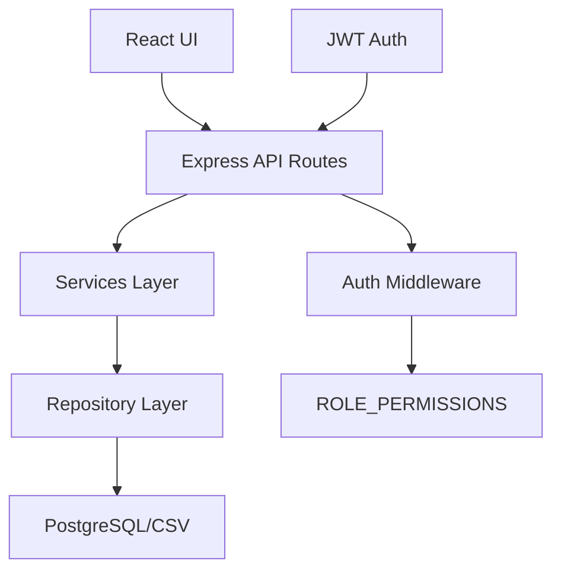
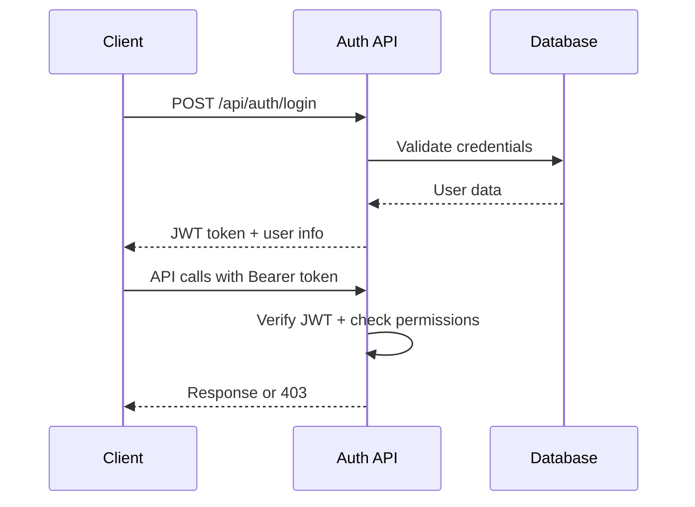

# StockFlow - Architecture Documentation

## 1. Project Structure

```
StockFlow/
  Backend/                    - Node.js + Express API Server
    src/
      app.js                 - Express app setup and middleware
      config/                - Configuration files
        auth.js             - JWT settings and ROLE_PERMISSIONS
        database.js         - PostgreSQL connection
      database/              - Database setup and migrations
      middlewares/           - Express middleware
        authMiddleware.js   - JWT authentication
      models/                - Data entities
      repositories/          - Data access layer (Repository Pattern)
      routes/                - API route definitions
      services/              - Business logic layer
  web/                       - React Frontend (official UI)
    src/
      components/            - React components
      context/              - React contexts (AuthContext)
      lib/                  - Utilities and API client
        api.ts              - Fetch-based API client
      pages/                - Page components
  Frontend/                  - Legacy/alternative frontend (not official)
  Database/                  - SQL schema files
  Docs/                      - Documentation
```

## 2. Architecture Overview

### Data Flow Diagram


### 3-Layer Architecture (Backend)

The backend follows a clean 3-layer architecture:

1. **Routes Layer** (`src/routes/`)
   - Defines API endpoints and HTTP methods
   - Handles request validation
   - Calls appropriate services
   - Returns JSON responses

2. **Services Layer** (`src/services/`)
   - Contains business logic
   - Orchestrates between multiple repositories
   - Handles data transformation and validation
   - No direct database access

3. **Repository Layer** (`src/repositories/`)
   - Data access abstraction
   - Handles all database operations
   - Supports both PostgreSQL and CSV fallback
   - Implements Repository Pattern

### Frontend Architecture

- **React.js + TypeScript** with **Tailwind CSS** for styling
- **Fetch API** for HTTP requests (NOT Axios)
- **Context API** for state management (AuthContext)
- **Component-based** architecture with pages and reusable components

## 3. Authentication & Authorization

### JWT Flow


### Permission System
- **Backend**: `ROLE_PERMISSIONS` in `Backend/src/config/auth.js`
- **Frontend**: Permissions fetched dynamically from `/api/auth/me`
- **Roles**: administrator, menaxher, staf
- **Zero duplication**: Backend is single source of truth

## 4. Database Strategy

### Primary: PostgreSQL
- Used when `DATABASE_URL` environment variable is set
- Full relational features, transactions, constraints

### Fallback: CSV Files
- Used when PostgreSQL is unavailable
- Limited functionality (no transactions, constraints)
- Some features may break without proper database

## 5. Frontend Details

### Official Frontend: `web/` directory
- Served as static files by Express from `/` route
- Built with React + TypeScript + Tailwind CSS
- Uses fetch API (see `web/src/lib/api.ts`)
- Auth context manages permissions from backend

### API Client (`web/src/lib/api.ts`)
- Centralized fetch wrapper with error handling
- Automatic JWT token attachment
- Robust error handling for network issues, non-JSON responses
- Consistent error messages for different HTTP status codes

## 6. Key Design Decisions

### Repository Pattern
- Separates business logic from data access
- Easy to switch between CSV and PostgreSQL
- Testable and maintainable code

### JWT-based Authentication
- Stateless authentication
- Role-based permissions
- Frontend fetches permissions dynamically

### Fetch over Axios
- Native browser API, no extra dependencies
- Custom error handling provides better UX
- Consistent response format across all endpoints

### Multi-frontend Support
- `web/` is the official React frontend
- `Frontend/` appears to be legacy/alternative
- Express serves the official frontend as static files

## 7. Module Dependencies

### Backend Dependencies
- Express.js for HTTP server
- JWT for authentication
- PostgreSQL client (pg)
- bcryptjs for password hashing
- CSV parsing for fallback storage

### Frontend Dependencies
- React 18 with TypeScript
- Tailwind CSS for styling
- No HTTP client library (uses native fetch)

## 8. Error Handling Strategy

### Backend
- Consistent JSON error responses
- Proper HTTP status codes
- Error logging for debugging

### Frontend
- Centralized error handling in `api.ts`
- User-friendly error messages
- Automatic session management
- Network failure detection

## 9. Security Considerations

- JWT tokens with expiration
- Password hashing with bcryptjs
- Role-based access control
- Input validation in routes
- SQL injection prevention (parameterized queries)

## 10. Development Workflow

1. Backend runs on Node.js with Express
2. Frontend React app is built and served statically
3. Single deployment serves both API and UI
4. Environment variables control database connection
5. Authentication state managed in frontend context