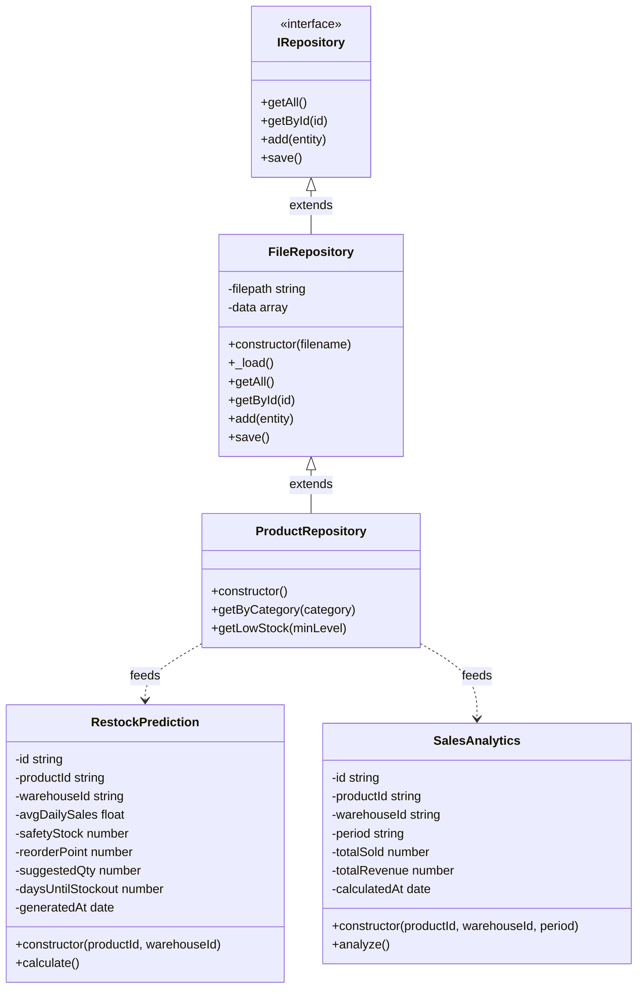

# StockFlow — Diagrami i Klasave (UML)

## Moduli 1 — Siguria & Përdoruesit
```mermaid
classDiagram
  class User {
    -id string
    -name string
    -email string
    -passwordHash string
    -isActive boolean
    -createdAt date
    +constructor(id, name, email, passwordHash, roleId)
  }
  class Role {
    -id string
    -name string
    -permissions json
    +constructor(id, name, permissions)
  }
  class AuthToken {
    -id string
    -userId string
    -token string
    -expiresAt date
    +constructor(userId, token, expiresAt)
  }
  class AuditLog {
    -id string
    -userId string
    -action string
    -entityType string
    -entityId string
    -oldValues json
    -newValues json
    -createdAt date
    +constructor(userId, action, entityType, entityId)
  }
  class Notification {
    -id string
    -userId string
    -type string
    -message string
    -isRead boolean
    -createdAt date
    +constructor(userId, type, message)
  }

  User }o--|| Role : ka rol
  User ||--o{ AuthToken : gjeneron
  User ||--o{ AuditLog : krijon
  User ||--o{ Notification : merr
```

## Moduli 2 — Produktet & Inventari
```mermaid
classDiagram
  class Product {
    -id string
    -name string
    -sku string
    -categoryId string
    -unitId string
    -minStockLevel number
    -isActive boolean
    +constructor(id, name, sku, categoryId, unitId, minStockLevel)
  }
  class Category {
    -id string
    -name string
    -parentId string
    +constructor(id, name, parentId)
  }
  class UnitOfMeasure {
    -id string
    -name string
    -abbreviation string
    +constructor(id, name, abbreviation)
  }
  class ProductPrice {
    -id string
    -productId string
    -price number
    -priceType string
    -validFrom date
    +constructor(productId, price, priceType, validFrom)
  }
  class CostHistory {
    -id string
    -productId string
    -cost number
    -recordedAt date
    +constructor(productId, cost, recordedAt)
  }
  class Warehouse {
    -id string
    -name string
    -location string
    -isActive boolean
    +constructor(id, name, location)
  }
  class WarehouseStock {
    -id string
    -productId string
    -warehouseId string
    -quantity number
    -reservedQty number
    -updatedAt date
    +constructor(productId, warehouseId, quantity)
  }

  Product }o--|| Category : i përket
  Product }o--|| UnitOfMeasure : matet me
  Product ||--o{ ProductPrice : ka çmime
  Product ||--o{ CostHistory : ka kosto
  Product ||--o{ WarehouseStock : ruhet në
  Warehouse ||--o{ WarehouseStock : ruan
```

## Moduli 3 — Lëvizjet e Stokut
```mermaid
classDiagram
  class Product {
    -id string
    -name string
    -sku string
    +constructor(id, name, sku)
  }
  class Warehouse {
    -id string
    -name string
    -location string
    +constructor(id, name, location)
  }
  class StockMovement {
    -id string
    -productId string
    -warehouseId string
    -type string
    -quantity number
    -referenceType string
    -referenceId string
    -createdBy string
    -createdAt date
    +constructor(productId, warehouseId, type, quantity)
  }
  class StockTransfer {
    -id string
    -fromWarehouseId string
    -toWarehouseId string
    -status string
    -createdBy string
    -createdAt date
    +constructor(fromWarehouseId, toWarehouseId)
  }
  class TransferItem {
    -id string
    -transferId string
    -productId string
    -quantity number
    +constructor(transferId, productId, quantity)
  }
  class StockAdjustment {
    -id string
    -productId string
    -warehouseId string
    -quantityChange number
    -reason string
    -createdBy string
    -createdAt date
    +constructor(productId, warehouseId, quantityChange, reason)
  }

  Product ||--o{ StockMovement : lëviz
  Product ||--o{ TransferItem : transferohet
  Product ||--o{ StockAdjustment : rregullohet
  Warehouse ||--o{ StockMovement : ndodh në
  Warehouse ||--o{ StockTransfer : dërgon nga
  StockTransfer ||--o{ TransferItem : përmban
```

## Moduli 4 — Furnitorët & Shitjet & Financat
```mermaid
classDiagram
  class Supplier {
    -id string
    -name string
    -contactEmail string
    -phone string
    -isActive boolean
    +constructor(id, name, contactEmail, phone)
  }
  class PurchaseOrder {
    -id string
    -supplierId string
    -status string
    -totalAmount number
    -orderDate date
    +constructor(supplierId, status, totalAmount)
  }
  class PurchaseOrderItem {
    -id string
    -orderId string
    -productId string
    -quantity number
    -unitCost number
    +constructor(orderId, productId, quantity, unitCost)
  }
  class Customer {
    -id string
    -name string
    -email string
    -phone string
    -address string
    +constructor(id, name, email, phone, address)
  }
  class SalesOrder {
    -id string
    -customerId string
    -warehouseId string
    -status string
    -totalAmount number
    -orderDate date
    +constructor(customerId, warehouseId, status)
  }
  class SalesOrderItem {
    -id string
    -orderId string
    -productId string
    -quantity number
    -unitPrice number
    +constructor(orderId, productId, quantity, unitPrice)
  }
  class Invoice {
    -id string
    -salesOrderId string
    -invoiceNumber string
    -amount number
    -status string
    -dueDate date
    +constructor(salesOrderId, invoiceNumber, amount)
  }
  class Payment {
    -id string
    -invoiceId string
    -paymentMethodId string
    -amount number
    -paidAt date
    +constructor(invoiceId, paymentMethodId, amount)
  }
  class PaymentMethod {
    -id string
    -name string
    -type string
    -isActive boolean
    +constructor(id, name, type)
  }

  Supplier ||--o{ PurchaseOrder : furnizon
  PurchaseOrder ||--o{ PurchaseOrderItem : përmban
  Customer ||--o{ SalesOrder : blen
  SalesOrder ||--o{ SalesOrderItem : përmban
  SalesOrder ||--|| Invoice : gjeneron
  Invoice ||--o{ Payment : paguhet me
  PaymentMethod ||--o{ Payment : metodë
```

## Moduli 5 — Repository Pattern & AI
