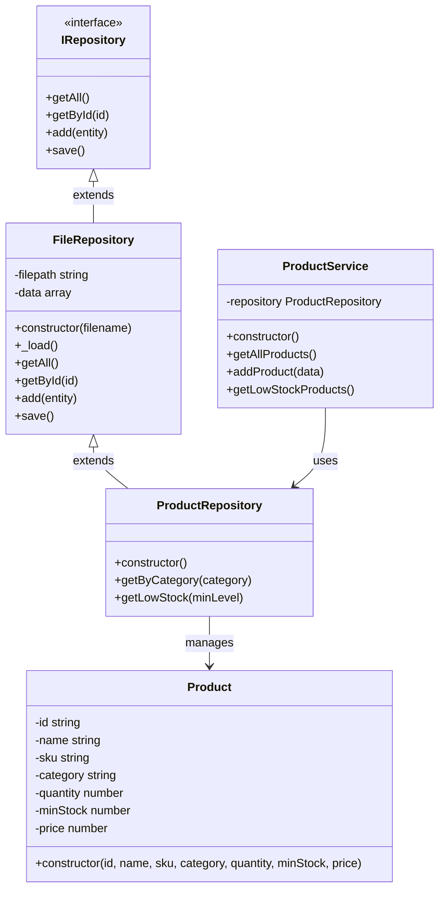

# StockFlow — Diagrami i Klasave (UML)

## Klasat Kryesore

## Përshkrimi i Klasave

### IRepository
Klasa bazë abstrakte që definon kontratën e Repository Pattern.
Çdo repository duhet të implementojë: `getAll()`, `getById()`, `add()`, `save()`.

### FileRepository
Implementon `IRepository`. Ruan dhe lexon të dhëna nga **CSV files**.
Metoda `_load()` lexon CSV-në automatikisht gjatë inicializimit.

### ProductRepository
Extends `FileRepository` për entitetin **Product**.
Shton metoda specifike: `getByCategory()` dhe `getLowStock()`.

### Product
Model që përfaqëson një produkt në inventar me atributet e tij.

### ProductService
Shtresa e **logjikës së biznesit** — ndërmjetëson mes Controller dhe Repository.